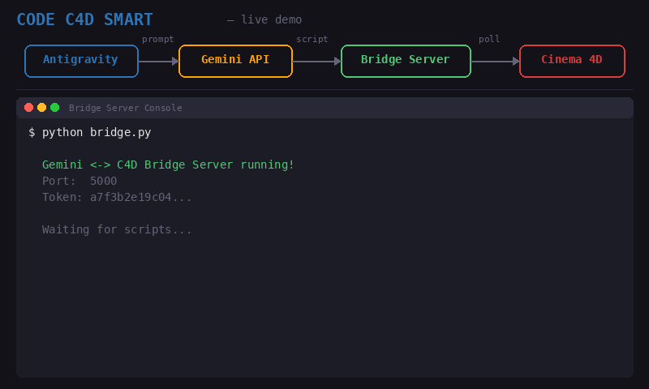

```
   ██████╗ ██████╗ ██████╗ ███████╗     ██████╗██╗  ██╗██████╗     ███████╗███╗   ███╗ █████╗ ██████╗ ████████╗
  ██╔════╝██╔═══██╗██╔══██╗██╔════╝    ██╔════╝██║  ██║██╔══██╗    ██╔════╝████╗ ████║██╔══██╗██╔══██╗╚══██╔══╝
  ██║     ██║   ██║██║  ██║█████╗      ██║     ███████║██║  ██║    ███████╗██╔████╔██║███████║██████╔╝   ██║   
  ██║     ██║   ██║██║  ██║██╔══╝      ██║     ╚════██║██║  ██║    ╚════██║██║╚██╔╝██║██╔══██║██╔══██╗   ██║   
  ╚██████╗╚██████╔╝██████╔╝███████╗    ╚██████╗     ██║██████╔╝    ███████║██║ ╚═╝ ██║██║  ██║██║  ██║   ██║   
   ╚═════╝ ╚═════╝ ╚═════╝ ╚══════╝     ╚═════╝     ╚═╝╚═════╝     ╚══════╝╚═╝     ╚═╝╚═╝  ╚═╝╚═╝  ╚═╝   ╚═╝   
```

> Connecte Gemini (ou n'importe quel LLM) à Cinema 4D. Décris ce que tu veux en langage naturel, la 3D se modifie en temps réel.

<p align="center">
  
</p>

---

## Comment ça marche

Le système repose sur un **bridge local** (serveur Flask) qui fait le lien entre l'IA et Cinema 4D :

```
┌─────────────┐     prompt      ┌───────────┐    script Python    ┌──────────────┐     poll 500ms     ┌────────────┐
│  Antigravity │ ──────────────► │  Gemini   │ ──────────────────► │ Bridge Server│ ◄─────────────────  │ Cinema 4D  │
│  (frontend)  │                 │  (API)    │                     │  (Flask)     │ ──────────────────► │  (plugin)  │
└─────────────┘                  └───────────┘                     └──────────────┘   script + exec     └────────────┘
                                                                         ▲                                    │
                                                                         └────────────────────────────────────┘
                                                                              résultat (succès / erreur)
```

1. Tu écris un prompt dans **Antigravity** → envoyé à l'API **Gemini**
2. Gemini génère un **script Python C4D** en réponse
3. Le script est posté sur le **Bridge Server** (`POST /execute`)
4. Le **plugin C4D** poll le serveur toutes les **500ms** et récupère le script
5. Le script est **exécuté en temps réel** dans Cinema 4D
6. Le **résultat** (succès ou erreur + traceback) est renvoyé au serveur pour feedback

---

## Installation

### 1. Cloner le repo

```bash
git clone https://github.com/ton-user/code-c4d-smart.git
cd code-c4d-smart
```

### 2. Installer les dépendances

```bash
pip install -r requirements.txt
```

### 3. Configurer le token

```bash
cp .env.example .env
```

Édite `.env` et choisis un token secret. Ce token sera partagé entre le serveur et le plugin C4D.

### 4. Lancer le serveur Bridge

```bash
source .env  # ou set les variables manuellement
python bridge.py
```

Le terminal affiche le token et les endpoints. **Garde-le ouvert.**

### 5. Installer le plugin Cinema 4D

Copie le dossier `c4d_plugin/` dans le répertoire plugins de C4D :

| OS | Chemin |
|---|---|
| **macOS** | `~/Library/Preferences/Maxon/Maxon Cinema 4D/plugins/` |
| **Windows** | `%APPDATA%\Maxon\Maxon Cinema 4D\plugins\` |

Renomme-le en `GeminiBridge/` si tu veux. Redémarre C4D.

### 6. Configurer le plugin

1. **Extensions → Gemini Bridge**
2. Colle le même token que celui du serveur
3. Règle l'intervalle à **500ms**
4. Clique **Démarrer l'écoute**

C'est prêt. Envoie un prompt depuis Antigravity et regarde ta scène se modifier.

---

## Endpoints

| Méthode | Route | Auth | Description |
|---------|-------|------|-------------|
| `POST` | `/execute` | Bearer | Envoie un script Python à exécuter dans C4D |
| `GET` | `/poll` | Bearer | Récupère le prochain script (utilisé par le plugin) |
| `POST` | `/result` | Bearer | Poste le résultat d'exécution depuis C4D |
| `GET` | `/result/<id>` | Bearer | Consulte le résultat d'un script |
| `GET` | `/health` | — | Health check (queue size, status) |

### Exemple d'envoi de script

```bash
curl -X POST http://127.0.0.1:5000/execute \
  -H "Authorization: Bearer $BRIDGE_TOKEN" \
  -H "Content-Type: application/json" \
  -d '{"script": "import c4d\ncube = c4d.BaseObject(c4d.Ocube)\ndoc.InsertObject(cube)\nc4d.EventAdd()"}'
```

---

## Structure du projet

```
code-c4d-smart/
├── bridge.py              # Serveur Flask (lance-le en premier)
├── requirements.txt       # Dépendances Python
├── .env.example           # Template de configuration
├── .gitignore
├── LICENSE                # MIT
├── assets/
│   └── demo.gif           # Démo animée
├── c4d_plugin/
│   └── GeminiBridge.pyp   # Plugin Cinema 4D
└── NOTES_TECHNIQUES.docx  # Documentation détaillée
```

---

## Dépannage

| Problème | Solution |
|----------|----------|
| Le plugin n'apparaît pas dans C4D | Vérifie que le `.pyp` est dans un sous-dossier de `plugins/`. Redémarre C4D. |
| Erreur 401 Unauthorized | Le token ne correspond pas entre serveur et plugin. Copie-le exactement. |
| Rien ne se passe après un prompt | Vérifie que le serveur tourne. Teste avec `curl http://127.0.0.1:5000/health` |
| Erreur dans la console C4D | Le traceback complet est dispo via `GET /result/<id>` |
| Port 5000 occupé | Change le port : `export BRIDGE_PORT=8080` |

---

## Pas que Gemini

Le bridge est **agnostique** : n'importe quel client HTTP peut envoyer des scripts sur `/execute`. Tu peux l'utiliser avec ChatGPT, Claude, un LLM local, ou même un simple script bash.

---

## Licence

[MIT](LICENSE) — fais-en ce que tu veux.
